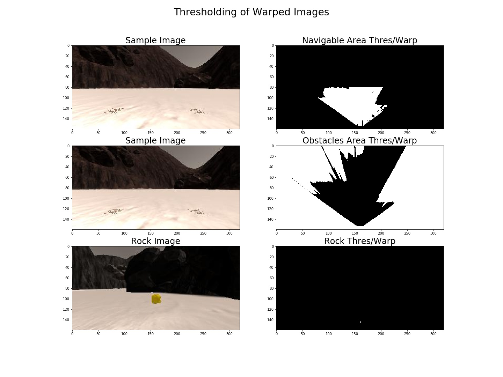

[](https://www.udacity.com/robotics)
# Project 1: Search and Sample Return
## Writeup by Muthanna A.Attyah
## Jan 2018

## [Rubric](https://review.udacity.com/#!/rubrics/916/view) Points

<p align="center">  </p>

## 1. Project Environment Preparation:

Please note that I have used the following environment to test/run the project:

* Operating System: **Ubuntu 16.04 LTS kernel 4.4.0-109-generic**
* Unity Simulator: **Roversim.x86_64**
* Unity Simulator Screen Resolution: **1024 x 640**
* Unity Simulator Graphics Quality: **Fantastic**
* Test Video recording FPS: **60 FPS**
* drive_rover.py FPS: **16-18 FPS**
* Anaconda: **Version 4.4.7**
* RoboND Anaconda Environment

**Note:** running the simulator with different choices of resolution and graphics quality may produce different results, particularly on different machines!  

## 2. Recording data in Training Mode

After getting the above mentioned environment components downloaded and installed, I have started reordering data from Rover Simulator in "Training Mode" using same resolution mentioned above. Recorded date was saved in two new folders "rec1_dataset" and "rec2_dataset" which will be used in addition to the already provided "test_dataset".

"rec1_dataset" is a short recording covering 28% of ground and I used it for rapid testing to fine tune image processing function. "rec2_dataset" is a long recording covering 100% of ground map and I used it to verify the final mapping and fidelity of image processing function before exporting it to perception.py script and testing it in autonomous mode.

## 4. Project Jupyter Notebook Analysis

Jupyter notebook was used to go through the full image processing pipeline starting from image aquestion until final navigation and mapping output.

### 4.1 Used Python Libraries

Following python libraries was used as part of notebook analysis:

* **numpy**: for array maths, image can be treated as array of numbers and modified using numpy.
* **matplotlib.pyplot**: to plot results in a very fancy figures and save them as images for this report.
* **matplotlib.image**: to read images from files.
* **cv2**: OpenCV for perspective transform.
* **glob**: to read in a list of images from a folder.
* **pandas**: to read a CSV file into a dataframe
* **imageio**: to read images and video.

## 4.2 Image Processing Pipeline

The project is covering all of the three major steps of a robot function (Perception, Decison, and Action). Perception step in this case is the image processing pipeline that will be required to process images aquired from the rover camera in order to:

* Produce rover driving angle.
* Detect any golden rocks in the way 
* Update World Map to reflect Navigation map

The pipeline can be summrized as shown in the following diagram:

<p align="center">  </p>

In the next sections I will discuss each stage function in the pipeline and show sample outputs from each.

## 4.3 Perspective Transform Function

First function in the pipeline is the perspective trnasform function which will convert image seen by the rover camera into a top-view image that will be used to map the navigable area, obistcale area, and golden rocks. Transformation calculation is done with help of the provided calibration grid image. coordinates of the grid square that is directly in front of the rover camera is taken as source:

```python
src = np.float32([
                 [14, 140],      # Left Bottom
                 [301 ,140],     # Right Bottom
                 [200, 96],      # Right Top
                 [118, 96]       # Left Top
                 ])              # above data captured from grid calibration image.
```

then one sequare in a top view map is taken as destination, adding 6 pixels to account for the unvisible distance from the rover edge to the 1st visible point.

```python
hs_size = 10/2             # half the size of one square
b_ofst  = 6                # bottom offset to account for distance from rover 
                           # edge to 1st camera visible point
x_cntr  = grid_img.shape[1]/2 # center of the image x axis
y_end   = grid_img.shape[0]   # end of y or bottom of image

dst = np.float32([
                 [x_cntr - hs_size, y_end - b_ofst],             # Left Bottom
                 [x_cntr + hs_size, y_end - b_ofst],             # Right Bottom
                 [x_cntr + hs_size, y_end - 2*hs_size - b_ofst], # Right Top
                 [x_cntr - hs_size, y_end - 2*hs_size - b_ofst], # Left Top
                 ])
```
Using OpenCV function 'cv2.warpPerspective()' we can now transform the prespective of aquired image from camera view into top-view.

```python
def perspect_transform(img, src, dst):

    M = cv2.getPerspectiveTransform(src, dst)  # Get transform matrix using src and dst boxes
    warped = cv2.warpPerspective(img,          # Warp image keep same size as input image 
                                 M, 
                                 (img.shape[1], img.shape[0]))
```

Below are outputs for navigable and rock sample images:

<p align="center">  </p>

## 4.4 Color Threshold Function

Next stage is the color thresholding function that will be required to identify the navigable, obistcale, and golden rock areas. Doing color thresholding on image before prespective transform or after the prespective transform will give the same results. So order is these two stages does not matter.

For navigable/obsticale thresholding I used RGB numbers as advised in the project template since it was working fine and I have tried values other then `rgb_thr=(160,160,160)` but reverted back later becuase I did not get any improved results in detection of navigable area.

```python
def navi_thresh(img):

    # Threshold of RGB > 160 does a nice job of identifying ground pixels only
    rgb_thr=(160,160,160)
     
    # mask will contain a boolean array with "True" for each pixel above threshold
    mask = (img[:,:,0] > rgb_thr[0]) \
         & (img[:,:,1] > rgb_thr[1]) \
         & (img[:,:,2] > rgb_thr[2])

    # Create an array of zeros same xy size as img, but single channel
    # Index the array with the mask and set to 1
    navi = np.zeros_like(img[:,:,0])
    navi[mask] = 1
    
    navi[:int(img.shape[0]*.5),:]=0 # clip upper 50% of image to improve fidelity
    
    # Create an array of ones same xy size as img, but single channel
    # Index the array with the mask and set to 0
    obst = np.ones_like(img[:,:,0])
    obst[mask] = 0
    
    obst[:int(img.shape[0]*.5),:]=1 # clip upper 50% of image to improve fidelity
    
    return navi,obst                        # Return both images

```


```python
def rock_thresh(img):
    
    hsv_img=cv2.cvtColor(img, cv2.COLOR_BGR2HSV)
    
    lower = np.array([0,200,100])
    upper = np.array([179,255,255])
    
    rock_t = cv2.inRange(hsv_img, lower, upper)
      
    return rock_t
```

<p align="center">  </p>

## 4.5 Perspective Transform and Color Thresholding of Sample Image

```python
navi_wt,obst_wt = navi_thresh(navi_w)  # Threshold warped image to show 
                                       # both navigable and obstacles areas
rock_wt         = rock_thresh(rock_w)  # Threshold calibration image to isolate the rock
```

<p align="center">  </p>

## 4.6 Rover Centric Coordinates Functions


```python
# Define a function to convert from image coords to rover coords
def rover_coords(binary_img):
    # Identify nonzero pixels
    ypos, xpos = binary_img.nonzero()
    # Calculate pixel positions with reference to the rover position being at the 
    # center bottom of the image.  
    x_pixel = -(ypos - binary_img.shape[0]).astype(np.float)
    y_pixel = -(xpos - binary_img.shape[1]/2 ).astype(np.float)
    return x_pixel, y_pixel

# Define a function to convert to radial coords in rover space
def to_polar_coords(x_pixel, y_pixel):
    # Convert (x_pixel, y_pixel) to (distance, angle) 
    # in polar coordinates in rover space
    # Calculate distance to each pixel
    dist = np.sqrt(x_pixel**2 + y_pixel**2)
    # Calculate angle away from vertical for each pixel
    angles = np.arctan2(y_pixel, x_pixel)
    return dist, angles

# Define a function to map rover space pixels to world space
def rotate_pix(xpix, ypix, yaw):
    # Convert yaw to radians
    yaw_rad = yaw * np.pi / 180
    xpix_rotated = (xpix * np.cos(yaw_rad)) - (ypix * np.sin(yaw_rad))
                            
    ypix_rotated = (xpix * np.sin(yaw_rad)) + (ypix * np.cos(yaw_rad))
    # Return the result  
    return xpix_rotated, ypix_rotated

def translate_pix(xpix_rot, ypix_rot, xpos, ypos, scale): 
    # Apply a scaling and a translation
    xpix_translated = (xpix_rot / scale) + xpos
    ypix_translated = (ypix_rot / scale) + ypos
    # Return the result  
    return xpix_translated, ypix_translated


# Define a function to apply rotation and translation (and clipping)
# Once you define the two functions above this function should work
def pix_to_world(xpix, ypix, xpos, ypos, yaw, world_size, scale):
    # Apply rotation
    xpix_rot, ypix_rot = rotate_pix(xpix, ypix, yaw)
    # Apply translation
    xpix_tran, ypix_tran = translate_pix(xpix_rot, ypix_rot, xpos, ypos, scale)
    # Perform rotation, translation and clipping all at once
    x_pix_world = np.clip(np.int_(xpix_tran), 0, world_size - 1)
    y_pix_world = np.clip(np.int_(ypix_tran), 0, world_size - 1)
    # Return the result
    return x_pix_world, y_pix_world
```


```python
# Grab another random image
idx = np.random.randint(0, len(img_list)-1)
navi_img = mpimg.imread(img_list[idx])

# Transform images
navi_w = perspect_transform(navi_img, src, dst)
navi_t,obst_t = navi_thresh(navi_w)

# Calculate pixel values in rover-centric coords and distance/angle to all pixels
xpix, ypix = rover_coords(navi_t)
dist, angles = to_polar_coords(xpix, ypix)
mean_dir = np.mean(angles)
angle = np.clip(mean_dir*180/np.pi,-15,15)
```

```python
print("dist =",dist[0:3])
print("angles =",angles[0:3])
print("mean_dir =",mean_dir)
print("Angle =",angle)
```

dist = [ 134.40238093  133.6001497   132.80060241]
angles = [ 0.93324753  0.92879222  0.92428318]
mean_dir = 0.549806601238
Angle = 15.0


<p align="center">  </p>

## 4.7 World Map Image

```python
# Rover yaw values will come as floats from 0 to 360
# Generate a random value in this range
# Note: you need to convert this to radians before adding to pixel_angles
rover_yaw = np.random.random(1)*360

# Generate a random rover position in world coords
# Position values will range from 20 to 180 to avoid the edges in a 200 x 200 pixel world
rover_xpos = np.random.random(1)*160 + 20
rover_ypos = np.random.random(1)*160 + 20

worldmap = np.zeros((200, 200))  # create empty image for use in testing
scale = 10                       # world map scale

# Note: Since we've chosen random numbers for yaw and position, 
# multiple run of the code will result in different outputs each time.

# Get navigable pixel positions in world coords

x_world, y_world = pix_to_world(xpix, ypix, 
                                rover_xpos, rover_ypos, rover_yaw, 
                                worldmap.shape[0], 
                                scale)


# Add pixel positions to worldmap

worldmap[y_world, x_world] += 1
```


```python
# Show results

print('Xpos =', rover_xpos, 'Ypos =', rover_ypos, 'Yaw =', rover_yaw)
```

Xpos = [ 98.39547196] Ypos = [ 154.14458693] Yaw = [ 225.00715458]

<p align="center">  </p>

## 4.8 Ground Truth Map

```python
map_path = '../calibration_images/map_bw.png'     # path to ground_truth image file

ground_truth = mpimg.imread(map_path)             # read ground_truth image

ground_truth_3d = np.dstack((ground_truth,      # Blue channel
                             ground_truth*255,  # Green channel
                             ground_truth       # Red channel
                            )
                           ).astype(np.float)   # all BGR numbers are float
```

<p align="center">  </p>

## 4.9 Reading Recorded Data

CSV file generated from the Rover Simulator Recorder will be having the following data columns:

(Path, SteerAngle, Throttle, Brake, Speed, X_Position, Y_Position, Pitch, Yaw, Roll)

Number of rows will depend on how long the recording was done. for each row there will be one captured image in /IMG subfolder.

You can pick one of the following datasets:

rec1_dataset
rec2_dataset
test_dataset
In [9]:


```python
csv_path = '../rec2_dataset/robot_log.csv'            # path to CSV file
df = pd.read_csv(csv_path,delimiter=';',decimal='.')  # read all columns/rows into dataframe

print(df[0:3])                                        # show 1st 3 samples
```
                                                Path  SteerAngle  Throttle  \
0  /home/mkhuthir/RoboND-Rover-Project/rec2_datas...         0.0       0.0   
1  /home/mkhuthir/RoboND-Rover-Project/rec2_datas...         0.0       0.0   
2  /home/mkhuthir/RoboND-Rover-Project/rec2_datas...         0.0       0.0   

   Brake  Speed  X_Position  Y_Position     Pitch       Yaw          Roll  
0    1.0    0.0    99.66999    85.58897  0.000236  56.82556 -2.498685e-07  
1    0.0    0.0    99.66999    85.58897  0.000236  56.82556 -4.337589e-07  
2    0.0    0.0    99.66999    85.58897  0.000236  56.82556 -3.314796e-07 


```python
csv_img_list = df["Path"].tolist()  # Create list of image pathnames

print(csv_img_list[0])              # Show 1st sample
```
/home/mkhuthir/RoboND-Rover-Project/rec2_dataset/IMG/robocam_2018_01_14_20_35_33_074.jpg


Will create a data container class and populate it with saved data from csv file and Woldmap. Worldmap is instantiated as 200 x 200 grid corresponding to a 200m x 200m space (same size as the ground truth map: 200 x 200 pixels). This encompasses the full range of output position values in x and y from the sim.

```python
# define the class

class Databucket():
    def __init__(self):
        self.images = csv_img_list  
        self.xpos = df["X_Position"].values
        self.ypos = df["Y_Position"].values
        self.yaw  = df["Yaw"].values
        self.pitch= df["Pitch"].values
        self.roll = df["Roll"].values
        self.sangl= df["SteerAngle"].values
        self.brake= df["Brake"].values
        self.throt= df["Throttle"].values
        self.speed= df["Speed"].values
        self.count = 0 # This will be a running index
        self.worldmap = np.zeros((200, 200, 3)).astype(np.float)
        self.ground_truth = ground_truth_3d # Ground truth worldmap

        
# Instantiate a Databucket()

data = Databucket()

# this will be a global variable/object that you can refer to in the process_image() function.
```

## 4.10 Image Processing Function

Populate the `process_image()` function with the appropriate analysis steps to map pixels identifying navigable terrain, obstacles and rock samples into a worldmap.  Run `process_image()` on your test data using the `moviepy` functions provided to create video output of your result. 
And another! 

```python
# Define a function to pass stored images to reading rover position and yaw angle from csv file
# This function will be used by moviepy to create an output video

def process_image(img):

# 1) Define source and destination points for perspective transform
#------------------------------------------------------------------
    
    scale    = 10             # each 10x10 pixel square represents 1 square meter
    hs_size  = scale/2        # half the size of one square
    b_ofst   = 6              # bottom offset to account for distance from rover edge to 1st camera visible point
    x_cntr   = img.shape[1]/2 # center of the image x axis
    x_max    = img.shape[1]   # end of x or right edge of image
    y_max    = img.shape[0]   # end of y or bottom edge of image
    
    rvr_xpos = data.xpos[data.count]
    rvr_ypos = data.ypos[data.count]
    rvr_yaw  = data.yaw[data.count]
    wrl_shp0 = data.worldmap.shape[0]
    
    
    src = np.float32([
                     [14, 140],      # Left Bottom
                     [301 ,140],     # Right Bottom
                     [200, 96],      # Right Top
                     [118, 96]       # Left Top
                     ])              # above data captured from grid calibration image.

    dst = np.float32([
                     [x_cntr - hs_size, y_max - b_ofst],             # Left Bottom
                     [x_cntr + hs_size, y_max - b_ofst],             # Right Bottom
                     [x_cntr + hs_size, y_max - 2*hs_size - b_ofst], # Right Top
                     [x_cntr - hs_size, y_max - 2*hs_size - b_ofst], # Left Top
                     ])
    
# 2) Apply perspective transform
#------------------------------------------------------------------

    img_w = perspect_transform(img, src, dst) #warp the image

# 3) Apply color threshold to identify navigable terrain/obstacles/rock samples
#------------------------------------------------------------------
    navi_wt,obst_wt = navi_thresh(img_w)  # Threshold warped image to show both navigable and obstacles areas
    rock_wt = rock_thresh(img_w)           # Threshold calibration image to isolate the rock
    
# 4) Convert thresholded image pixel values to rover-centric coords
#------------------------------------------------------------------
    navix_pix, naviy_pix = rover_coords(navi_wt)  # convert navigable area thresholded to rover coords.
    obstx_pix, obsty_pix = rover_coords(obst_wt)  # convert obstacle area thresholded to rover coords.
    rockx_pix, rocky_pix = rover_coords(rock_wt)  # convert rock thresholded to rover coords.
        
# 5) Convert rover-centric pixel values to world coords
#------------------------------------------------------------------
    
    naviy_wld, navix_wld = pix_to_world(navix_pix, naviy_pix,          # convert navigable area
                                        rvr_xpos, rvr_ypos, rvr_yaw,
                                        wrl_shp0,scale)
    
    obsty_wld, obstx_wld = pix_to_world(obstx_pix, obsty_pix,          # convert obsticale area
                                        rvr_xpos, rvr_ypos, rvr_yaw,
                                        wrl_shp0,scale)
    
    rocky_wld, rockx_wld = pix_to_world(rockx_pix, rocky_pix,          # convert rock area
                                        rvr_xpos, rvr_ypos, rvr_yaw,
                                        wrl_shp0,scale)
    
    
    
# 6) Update worldmap (to be displayed on right side of screen)
#------------------------------------------------------------------
    data.worldmap[obstx_wld, obsty_wld, 0] = 255 # set obsticale area pixels to RED
    data.worldmap[navix_wld, naviy_wld, 2] = 255 # set navigable area pixels to BLUE
    data.worldmap[rockx_wld, rocky_wld, :] = 255 # set rock area to WHITE

    navi = data.worldmap[:,:,2]==255 # index of all navigable pixels
    data.worldmap[navi,0]=0          # reset corresponding obsticale pixels
    
    
# 7) Make a mosaic image
#------------------------------------------------------------------     
    frame = np.zeros((img.shape[0] + data.worldmap.shape[0], 
                      img.shape[1]*2, 
                      3))                          # create a blank image
    frame[0:img.shape[0], 0:img.shape[1]] = img    # add camera image to top-left
    frame[0:img.shape[0], img.shape[1]:]  = img_w  # add warped image to top-right

    map_add = cv2.addWeighted(data.worldmap,1,     # mix world map with ground truth
                              data.ground_truth,0.5,
                              0) 

    
# 8) Add rover location and direction marker to mosaic image
#------------------------------------------------------------------    

    
    ryaw  = rvr_yaw*np.pi/180               # convert yaw from deg to rad
    
    ac = (255,255,255)                      # arrow color
    al = 5                                  # arrow half length
    fx = int(rvr_xpos+(al * np.cos(ryaw)))  # arrow head point x based on current rover yaw
    fy = int(rvr_ypos+(al * np.sin(ryaw)))  # arrow head point y based on current rover yaw
    bx = int(rvr_xpos)                      # arrow start point x
    by = int(rvr_ypos)                      # arrow start point y
            
    cv2.arrowedLine(map_add,(bx,by),(fx,fy),ac)
        
    frame[img.shape[0]:, 0:data.worldmap.shape[1]] = np.flipud(map_add)  # add mixed map to bottom-left


# 9) Show telemetry values (bottom-right)
#------------------------------------------------------------------

    # Calculate some statistics on the map results
    
    # total pix in the navigable area
    tot_nav_pix = np.float(len((data.worldmap[:,:,2].nonzero()[0])))  
    
    # how many correspond to truth
    good_nav_pix = np.float(len(((data.worldmap[:,:,2] > 0) & (data.ground_truth[:,:,1] > 0)).nonzero()[0]))
    
    # how many do not correspond to truth
    bad_nav_pix = np.float(len(((data.worldmap[:,:,2] > 0) & (data.ground_truth[:,:,1] == 0)).nonzero()[0]))
    
    # Grab the total number of map pixels
    tot_map_pix = np.float(len((data.ground_truth[:,:,1].nonzero()[0])))
    
    # Calculate the percentage of ground truth map that has been successfully found
    perc_mapped = round(100*good_nav_pix/tot_map_pix, 1)
    
    # number of good map pixel detections divided by total pixels found to be navigable terrain
    if tot_nav_pix > 0:
        fidelity = round(100*good_nav_pix/(tot_nav_pix), 1)
    else:
        fidelity = 0


    # text style
    tox =img.shape[1]+20          # Text X offset from top left corner
    toy =img.shape[0]             # Text Y offset from top left corner
    tc  =(255, 255, 255)          # Text color
    tc2 =(0, 255, 0)          # Text color 2
    tf  =cv2.FONT_HERSHEY_COMPLEX # Text font
    ts  =0.4                      # Text size
    
    # text value
    txt1="Xpos="+str(np.round(data.xpos[data.count],2))+\
         " Ypos="+str(np.round(data.ypos[data.count],2))
        
    txt2="Yaw="+str(np.round(data.yaw[data.count],2))+\
         " Roll="+str(np.round(data.roll[data.count],2))
            
    txt3="Pitch="+str(np.round(data.pitch[data.count],2))+\
         " S.Angle="+str(np.round(data.sangl[data.count],2))
         
    
    txt4="Throttle="+str(np.round(data.throt[data.count],2))+\
         " Speed="+str(np.round(data.speed[data.count],2))
         
    txt5="Brake="+str(np.round(data.brake[data.count],2))
    
    txt6="Mapped: "+str(perc_mapped)+'%'
    
    txt7="Fidelity: "+str(fidelity)+'%'
    
    txt8="RoboND Project 1"
    
    txt9="By: Muthanna Attyah"
    
    # Add text to frame
    cv2.putText(frame,txt1,(tox,toy+20),tf,ts,tc,1)
    cv2.putText(frame,txt2,(tox,toy+40),tf,ts,tc,1)
    cv2.putText(frame,txt3,(tox,toy+60),tf,ts,tc,1)
    cv2.putText(frame,txt4,(tox,toy+80),tf,ts,tc,1)
    cv2.putText(frame,txt5,(tox,toy+100),tf,ts,tc,1)
    cv2.putText(frame,txt6,(tox,toy+120),tf,ts,tc,1)
    cv2.putText(frame,txt7,(tox,toy+140),tf,ts,tc,1)
    cv2.putText(frame,txt8,(tox+140,toy+120),tf,ts,tc2,1)
    cv2.putText(frame,txt9,(tox+140,toy+140),tf,ts,tc2,1)
    
#------------------------------------------------------------------
    
    if data.count < len(data.images) - 1:
        data.count += 1 # Keep track of the index in the Databucket()
    
    return frame

```

```python
# test function with one sample
data = Databucket()

# Grab random image from data
idx = np.random.randint(0, len(data.images) - 1) 
navi_img = mpimg.imread(data.images[idx])
tst_frame = process_image(navi_img)

# Show frame
f,ax =  plt.subplots(1, 1, figsize=(14,7))
ax.set_title('One Sample Video Frame', fontsize=20)
ax.imshow(tst_frame.astype(np.uint8))

# Save figure for project report
f.savefig('../output/test_frame.jpg')
```

<p align="center">  </p>

## 4.11 Producing a Video to test image processing pipeline

The final testing video after implementing all above mentioned steps is uploaded on YouTube on the following link:

[](http://www.youtube.com/watch?v=3z5Nvw0yioA)

as you can see in the video after covering more than 99.4% of the ground; fidelity was 56.5% which is acceptable for this test but it can be much further improved.

## 5. Exporting Image Processing function to perception.py script

Fill in the `perception_step()` (at the bottom of the `perception.py` script) and `decision_step()` (in `decision.py`) functions in the autonomous mapping scripts and an explanation is provided in the writeup of how and why these functions were modified as they were.

## 6. Updateing Decision Script

Fill in the `decision_step()` function within the `decision.py` script with conditional statements that take into consideration the outputs of the `perception_step()` in deciding how to issue throttle, brake and steering commands. 

## 7. Running **Autonomous Navigation/Mapping**

As per the project requirment the rover must **map at least 40%** of the environment with **60% fidelity** (accuracy) against the ground truth. You must also find (map) the location of **at least one rock sample**. They don't need to pick any rocks up, just have them appear in the map (should happen automatically if their map pixels in `Rover.worldmap[:,:,1]` overlap with sample locations.

Launching in autonomous mode your rover can navigate and map autonomously.  
Explain your results and how you might improve them in your writeup.  

Iterate on your perception and decision function until your rover does a reasonable (need to define metric) job of navigating and mapping.  


## 8. Future improvments.

Color thresholding used for identification of navigable area can be furher improved to get better accuracy; one way to improve it is to use a range of colors instead of lower limit since this will help in excluding the sky color when the rover is facing one of the low terrian areas in which sky is visible to camera. 

Image transformation can also be further improved by applying a better image cropping mask before transforming the perspective. In my code I clipped upper 50% part of the image using a stright line and there was very good improvement in results. Trying a curve clipping might give even better results.

Another way is to skip images that are aquired when the rover having a +ve or -ve pitch not near zero as suggested in project text.
