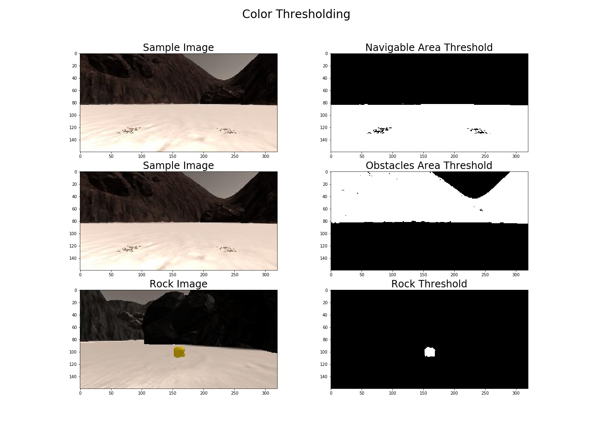
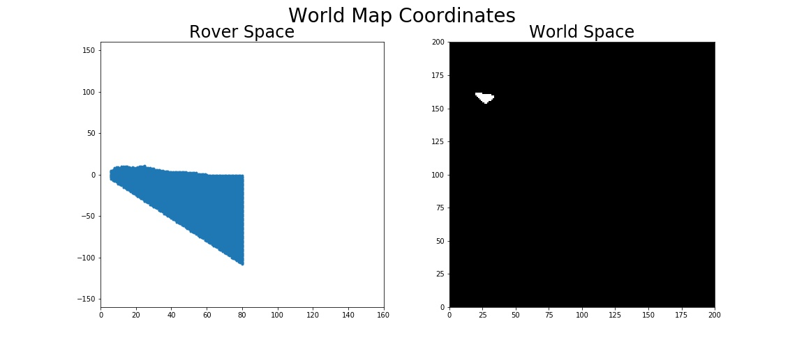

[](https://www.udacity.com/robotics)
# Project 1: Search and Sample Return
## Writeup by Muthanna A.Attyah
## Jan 2018

## [Rubric](https://review.udacity.com/#!/rubrics/916/view) Points

<p align="center">  </p>

## 1. Project Environment Preparation:

Please note that I have used the following environment to test/run the project:

* Operating System: **Ubuntu 16.04 LTS kernel 4.4.0-109-generic**
* Unity Simulator: **Roversim.x86_64**
* Unity Simulator Screen Resolution: **1024 x 640**
* Unity Simulator Graphics Quality: **Fantastic**
* Test Video recording FPS: **60 FPS**
* drive_rover.py FPS: **16-18 FPS**
* Anaconda: **Version 4.4.7**
* RoboND Anaconda Environment

**Note:** running the simulator with different choices of resolution and graphics quality may produce different results, particularly on different machines!  

## 2. Recording data in Training Mode

After getting the above mentioned environment components downloaded and installed, I have started reordering data from Rover Simulator in "Training Mode" using same resolution mentioned above. Recorded date was saved in two new folders "rec1_dataset" and "rec2_dataset" which will be used in addition to the already provided "test_dataset".

"rec1_dataset" is a short recording covering 28% of ground and I used it for rapid testing to fine tune image processing function. "rec2_dataset" is a long recording covering 100% of ground map and I used it to verify the final mapping and fidelity of image processing function before exporting it to perception.py script and testing it in autonomous mode.

## 4. Project Jupyter Notebook Analysis

Jupyter notebook was used to go through the full image processing pipeline starting from image aquestion until final navigation and mapping output.

### 4.1 Used Python Libraries

Following python libraries was used as part of notebook analysis:

* **numpy**: for array maths, image can be treated as array of numbers and modified using numpy.
* **matplotlib.pyplot**: to plot results in a very fancy figures and save them as images for this report.
* **matplotlib.image**: to read images from files.
* **cv2**: OpenCV for perspective transform.
* **glob**: to read in a list of images from a folder.
* **pandas**: to read a CSV file into a dataframe
* **imageio**: to read images and video.

## 4.2 Image Processing Pipeline

From a highlevel, the image processing pipeline that will be required to process images aquired from the rover camera in order to produce rover driving angles and detect any golden rocks in the way will be as shown in below diagram.

<p align="center">  </p>

The next sections will discuss each function in the pipeline and show sample outputs from each.

## 4.3 Transform Function
```python
def navi_thresh(img):

    # Threshold of RGB > 160 does a nice job of identifying ground pixels only
    rgb_thr=(160,160,160)
     
    # mask will contain a boolean array with "True" for each pixel above threshold
    mask = (img[:,:,0] > rgb_thr[0]) \
         & (img[:,:,1] > rgb_thr[1]) \
         & (img[:,:,2] > rgb_thr[2])

    # Create an array of zeros same xy size as img, but single channel
    # Index the array with the mask and set to 1
    navi = np.zeros_like(img[:,:,0])
    navi[mask] = 1
    
    navi[:int(img.shape[0]*.5),:]=0 # clip upper 50% of image to improve fidelity
    
    # Create an array of ones same xy size as img, but single channel
    # Index the array with the mask and set to 0
    obst = np.ones_like(img[:,:,0])
    obst[mask] = 0
    
    obst[:int(img.shape[0]*.5),:]=1 # clip upper 50% of image to improve fidelity
    
    return navi,obst                        # Return both images
```
<p align="center">  </p>

## 4.4 Color Threshold Function

<p align="center">  </p>

## 4.5 Transform and Color Thresholding of Sample Image

<p align="center">  </p>

## 4.6 Rover Centric Coordinates Functions

<p align="center">  </p>

## 4.7 World Map Image
<p align="center">  </p>

## 4.8 Ground Truth Map

<p align="center">  </p>

## 4.9 Image Processing Function

Populate the `process_image()` function with the appropriate analysis steps to map pixels identifying navigable terrain, obstacles and rock samples into a worldmap.  Run `process_image()` on your test data using the `moviepy` functions provided to create video output of your result. 
And another! 

<p align="center">  </p>

## 4.10 Producing a Video to test image processing pipeline

The final testing video after implementing all above mentioned steps is uploaded on YouTube on the following link:

[](http://www.youtube.com/watch?v=3z5Nvw0yioA)

as you can see in the video after covering more than 99.4% of the ground; fidelity was 56.5% which is acceptable for this test but it can be much further improved.

## 5. Exporting Image Processing function to perception.py script
Fill in the `perception_step()` (at the bottom of the `perception.py` script) and `decision_step()` (in `decision.py`) functions in the autonomous mapping scripts and an explanation is provided in the writeup of how and why these functions were modified as they were.

## 6. Running **Autonomous Navigation/Mapping**

Launching in autonomous mode your rover can navigate and map autonomously.  
Explain your results and how you might improve them in your writeup.  

* Fill in the `perception_step()` function within the `perception.py` script with the appropriate image processing functions to create a map and update `Rover()` data (similar to what you did with `process_image()` in the notebook). 
* Fill in the `decision_step()` function within the `decision.py` script with conditional statements that take into consideration the outputs of the `perception_step()` in deciding how to issue throttle, brake and steering commands. 
* Iterate on your perception and decision function until your rover does a reasonable (need to define metric) job of navigating and mapping.  


## 7. Future improvments.
Here I'll talk about the approach I took, what techniques I used, what worked and why, where the pipeline might fail and how I might improve it if I were going to pursue this project further.  


